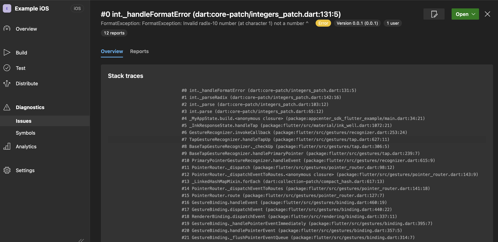

# App Center SDK for Flutter

This package supports only the **Analytics** and **Crashes** parts of the sdk.

## Usage

```dart
import 'package:appcenter_sdk_flutter/appcenter_sdk_flutter.dart';
import 'package:flutter/material.dart';

Future<void> main() async {
  WidgetsFlutterBinding.ensureInitialized();
  await AppCenter.start(secret: '<APP-SECRET>');
  FlutterError.onError = (final details) async {
    await AppCenterCrashes.trackException(
      message: details.exception.toString(),
      type: details.exception.runtimeType,
      stackTrace: details.stack,
    );
  };
  runApp(const MyApp());
}

class MyApp extends StatefulWidget {
  const MyApp({super.key});

  @override
  State<MyApp> createState() => _MyAppState();
}

class _MyAppState extends State<MyApp> {
  @override
  Widget build(final BuildContext context) => MaterialApp(
        home: Scaffold(
          appBar: AppBar(
            title: const Text('App Center Sdk'),
          ),
          body: Center(
            child: ElevatedButton(
              onPressed: () {
                int.parse('not a number');
              },
              child: const Text('TrackException'),
            ),
          ),
        ),
      );
}
```

### AppCenter

```dart
await AppCenter.start('secret');
await AppCenter.enable();
await AppCenter.disable();
final isEnabled = await AppCenter.isEnabled();
final isConfigured = await AppCenter.isConfigured();
final installId = await AppCenter.getInstallId();
final isRunningInAppCenterTestCloud = await AppCenter.isRunningInAppCenterTestCloud();
```

### AppCenter Analytics

```dart
  await AppCenter.trackEvent(name: 'A Event', properties: {'property':'value'}, flags: 1);
  await AppCenter.pause();
  await AppCenter.resume();
  await AppCenter.enable();
  await AppCenter.disable();
  final isEnabled = await AppCenter.isEnabled();
  await AppCenter.enableManualSessionTracker();
  await AppCenter.startSession();
  final isSetted =  AppCenter.setTransmissionInterval(3);
```

### AppCenter Crashes

```dart
  await generateTestCrash();

  final hasReceivedMemoryWarningInLastSession = AppCenterCrashes.hasReceivedMemoryWarningInLastSession();

  final hasCrashedInLastSession = AppCenterCrashes.hasCrashedInLastSession();

  await AppCenterCrashes.enable();

  await AppCenterCrashes.disable();

  final isEnabled = AppCenterCrashes.isEnabled();

  await AppCenterCrashes.trackException(message: 'MessageException', type: MessageException.runtimeType, stackTrace: StackTrace.fromString('stackTraceString'), properties: {'property':'value'});
```

When using the `trackException`, the flutter stack trace will appear in App Center.

|Android|iOS|
| - | - |
|||
